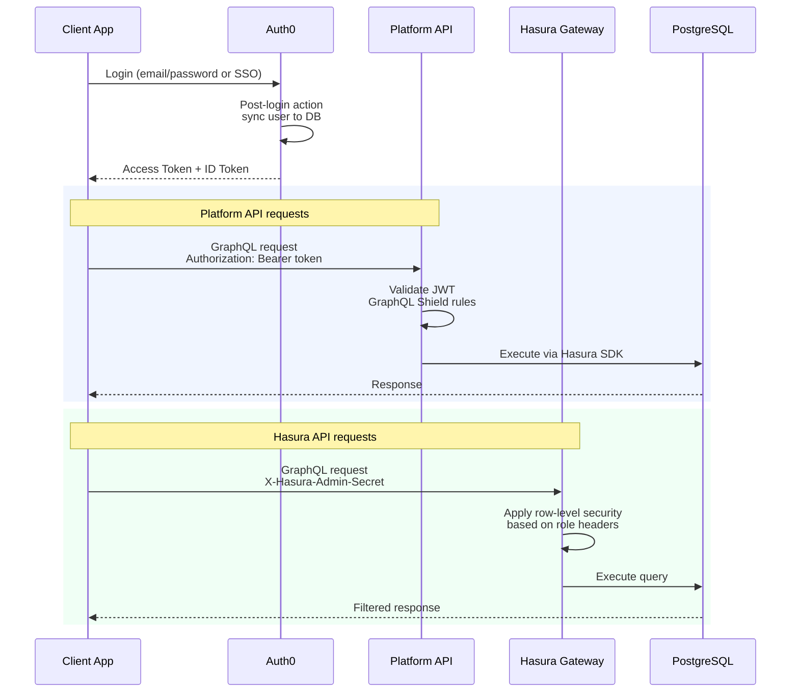

# Authentication

All Agio API access requires authentication using organization-level API keys. This guide explains how to obtain and use API keys for secure access.

## API Key Overview

API keys are issued at the organization level and provide access based on your configured permissions tier. Each key:

- Is unique to your organization
- Has customizable access permissions
- Can be rotated without affecting other integrations
- Includes usage tracking and rate limiting

## Obtaining an API Key

To request an API key:

1. Contact your Agio account manager
2. Specify your required access categories (see [API Categories](/api/#api-categories))
3. Provide the IP addresses or ranges to whitelist (optional but recommended)
4. Receive your API key securely

## Using Your API Key

### HTTP Header Authentication

Include your API key in the `X-API-Key` header with every request:

```bash
curl -X POST https://api.agiodigital.com/graphql \
  -H "Content-Type: application/json" \
  -H "X-API-Key: your-api-key-here" \
  -d '{"query": "{ ping }"}'
```

### JavaScript/TypeScript Example

```typescript
import { ApolloClient, InMemoryCache, createHttpLink } from "@apollo/client";
import { setContext } from "@apollo/client/link/context";

const httpLink = createHttpLink({
  uri: "https://api.agiodigital.com/graphql"
});

const authLink = setContext((_, { headers }) => {
  return {
    headers: {
      ...headers,
      "X-API-Key": process.env.AGIO_API_KEY
    }
  };
});

const client = new ApolloClient({
  link: authLink.concat(httpLink),
  cache: new InMemoryCache()
});
```

### Python Example

```python
import requests

url = "https://api.agiodigital.com/graphql"
headers = {
    "Content-Type": "application/json",
    "X-API-Key": "your-api-key-here"
}

query = """
{
    ping
}
"""

response = requests.post(url, json={"query": query}, headers=headers)
print(response.json())
```

## Authentication Flow



## Hasura API Authentication

For the Hasura API, use the same API key in the `X-Hasura-Admin-Secret` header:

```bash
curl -X POST https://hasura.agiodigital.com/v1/graphql \
  -H "Content-Type: application/json" \
  -H "X-Hasura-Admin-Secret: your-api-key-here" \
  -d '{"query": "{ user { id } }"}'
```

For role-based access, include the role header:

```bash
curl -X POST https://hasura.agiodigital.com/v1/graphql \
  -H "Content-Type: application/json" \
  -H "X-Hasura-Admin-Secret: your-api-key-here" \
  -H "X-Hasura-Role: organization_admin" \
  -H "X-Hasura-Organization-Id: your-org-id" \
  -d '{"query": "{ organization { name } }"}'
```

## Security Best Practices

### Store Keys Securely

- Never commit API keys to version control
- Use environment variables or secret management systems
- Rotate keys periodically

```bash
# .env file (never commit this)
AGIO_API_KEY=your-api-key-here
```

### Restrict Key Scope

Request only the permissions you need for your use case.

### IP Whitelisting

Request IP whitelisting for your API keys to prevent unauthorized access:

- Provide static IP addresses for your servers
- Use VPN or private networks where possible
- Update whitelist when infrastructure changes

### Monitor Usage

Review your API usage regularly through the Agio admin dashboard:

- Track request volumes
- Monitor error rates
- Identify unusual patterns

## Error Responses

### Authentication Errors

| Status Code | Error          | Description                        |
| ----------- | -------------- | ---------------------------------- |
| 401         | `UNAUTHORIZED` | Missing or invalid API key         |
| 403         | `FORBIDDEN`    | API key lacks required permissions |
| 429         | `RATE_LIMITED` | Too many requests                  |

Example error response:

```json
{
  "errors": [
    {
      "message": "Invalid API key",
      "extensions": {
        "code": "UNAUTHORIZED"
      }
    }
  ]
}
```

## Key Rotation

To rotate your API key:

1. Request a new key from your account manager
2. Update your applications to use the new key
3. Test the new key in a staging environment
4. Deploy the update to production
5. Request deactivation of the old key

We recommend rotating keys:

- Every 90 days for routine security
- Immediately if a key may have been compromised
- When team members with access leave the organization

## Next Steps

- [GraphQL API Overview](/api/graphql-overview) - Explore available queries and mutations
- [Examples](/api/examples) - See complete code examples
- [Hasura API Overview](/api/hasura/overview) - Learn about database-level access
