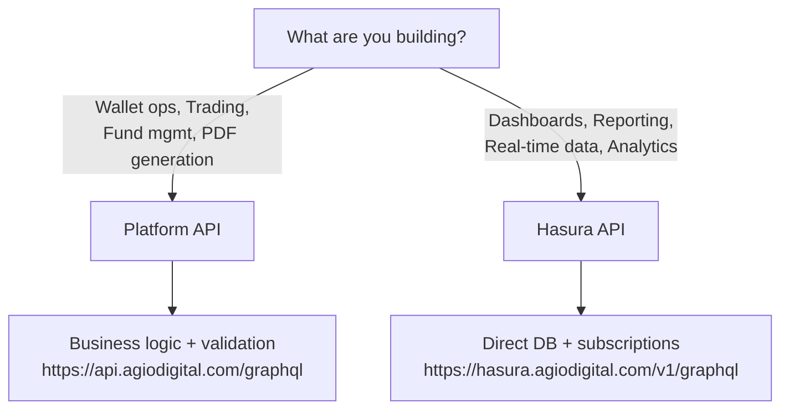

# API Reference

The Agio Platform provides two complementary GraphQL APIs for building integrations and automating workflows.

## Available APIs

### Platform API (agio-platform-api)

The primary application-level GraphQL API built with Apollo Server. This API handles:

- **Portfolio Management** - Query wallet balances, asset allocations, and net worth calculations
- **Wallet Operations** - Create wallets, manage addresses, and handle whitelist entries
- **Trading** - Request OTC quotes, execute trades, and access order books
- **KYC/Compliance** - Access KYC profiles, verification status, and AML reports
- **Fund Administration** - Manage fund subscriptions, redemptions, and NAV queries
- **Document Generation** - Generate PDFs for statements, invoices, and agreements

### Hasura API

A database-driven GraphQL API powered by Hasura GraphQL Engine. This provides:

- **Direct Database Access** - Query over 800+ tables across all business domains
- **Real-time Subscriptions** - Subscribe to data changes in real-time
- **Fine-grained Permissions** - Role-based access control at row and column level
- **Aggregations** - Perform complex aggregations and analytics queries

## API Categories

| Category                   | Description                                                        |
| -------------------------- | ------------------------------------------------------------------ |
| **Wallets & Custody**      | Create wallets, manage addresses, query balances, whitelist entries |
| **Trading & OTC**          | Request quotes, execute trades, access order books                 |
| **Fund Administration**    | Fund subscriptions, redemptions, NAV queries, investor management  |
| **KYC & Compliance**       | Verification status, KYC profiles, AML reports                     |
| **Cards & Payments**       | Corporate card management, funding, transactions                   |
| **Documents & Reporting**  | PDF generation, statements, invoices, agreements                   |

## Which API Should I Use?

## Getting Started

  <a class="vt-box" href="/api/authentication">
    
Authentication

    
Learn how to authenticate with API keys.

  </a>
  <a class="vt-box" href="/api/graphql-overview">
    
GraphQL API

    
Explore the Platform API queries and mutations.

  </a>
  <a class="vt-box" href="/api/hasura/overview">
    
Hasura API

    
Access database tables directly via GraphQL.

  </a>

## Base URLs

| Environment | Platform API                                  | Hasura API                                              |
| ----------- | --------------------------------------------- | ------------------------------------------------------- |
| Production  | `https://api.agiodigital.com/graphql`         | `https://hasura.agiodigital.com/v1/graphql`             |
| Development | `https://dev.api.agiodigital.com/graphql`     | `https://develop-agiodigital.hasura.app/v1/graphql`     |

## Rate Limits

API rate limits are applied per organization API key:

- **Standard**: 100 requests/minute
- **Extended**: 1,000 requests/minute (by arrangement)
- **Unlimited**: Available for enterprise clients

Contact your account manager to discuss rate limit adjustments.
