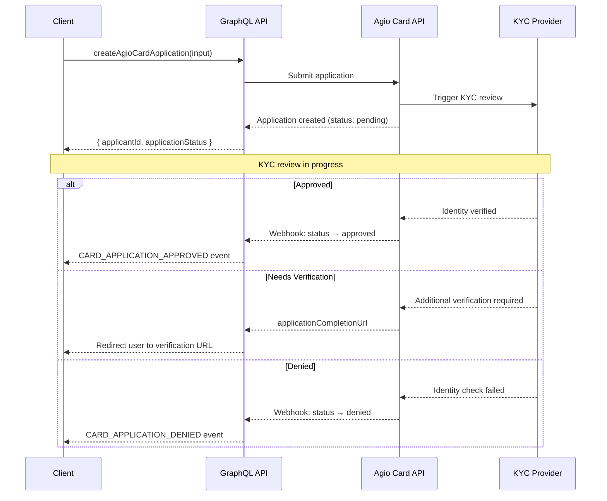
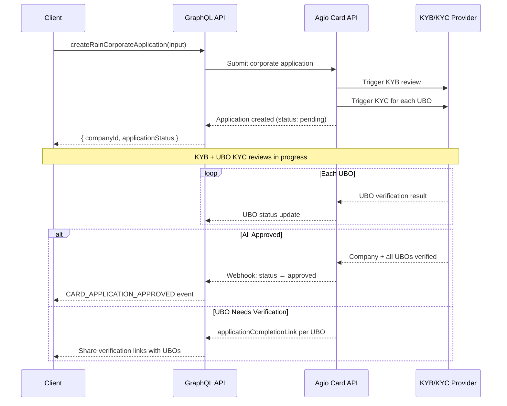

# Applying for Cards

Before issuing cards, users must complete a card application that triggers KYC (Know Your Customer) for individuals or KYB (Know Your Business) for companies. Once approved, the identity can issue unlimited cards without repeating the verification process.

## Individual Application

Individual applications collect personal identity information and submit it to Agio for KYC/AML review.

### Application Flow



### Submit an Application

```graphql
mutation CreateAgioCardApplication($input: CreateAgioCardApplicationInput!) {
  createAgioCardApplication(input: $input) {
    success
    applicantId
    rainApplicationId
    applicationStatus
    applicationCompletionUrl
    shareToken
    error
  }
}
```

```graphql
# Variables
{
  "input": {
    "walletAddress": "0x1234...abcd",
    "occupation": "Software Developers",
    "annualSalary": "100000_TO_150000",
    "accountPurpose": "PERSONAL_SPENDING",
    "expectedMonthlyVolume": "1000_TO_5000",
    "isTermsOfServiceAccepted": true,
    "cardNickname": "My Card",
    "requestedLimitAmount": 25000,
    "requestedLimitFrequency": "30 day"
  }
}
```

### Input Fields

| Field                      | Type     | Description                                                                       |
| -------------------------- | -------- | --------------------------------------------------------------------------------- |
| `walletAddress`            | String!  | Ethereum (`0x...`) or Solana (base58) wallet address                              |
| `occupation`               | String!  | SOC occupation description (e.g., `"Software Developers"`, `"Chief Executives"`)  |
| `annualSalary`             | String!  | Salary range (e.g., `"100000_TO_150000"`)                                         |
| `accountPurpose`           | String!  | Purpose of the account (e.g., `"PERSONAL_SPENDING"`, `"BUSINESS"`)                |
| `expectedMonthlyVolume`    | String!  | Expected monthly volume range (e.g., `"1000_TO_5000"`)                            |
| `isTermsOfServiceAccepted` | Boolean! | Must be `true` to proceed                                                         |
| `cardNickname`             | String   | Optional display name for the first card                                          |
| `requestedLimitAmount`     | Int      | Desired credit limit in dollars (e.g., `25000`)                                   |
| `requestedLimitFrequency`  | String   | Limit period (e.g., `"30 day"`, `"7 day"`)                                        |
| `sessionId`                | String   | Session ID from `generateEncryptionKeys` (required if setting PIN at application) |
| `encryptedPin`             | String   | Pre-encrypted PIN to stage for the first card                                     |

### Response

If the response includes an `applicationCompletionUrl`, redirect the user to that URL to complete additional verification steps (e.g., document upload, selfie).

## Corporate Application

Corporate applications onboard a company and its beneficial owners. The process triggers KYB for the company entity and individual KYC for each Ultimate Beneficial Owner (UBO).

### Application Flow



### Submit a Corporate Application

```graphql
mutation CreateRainCorporateApplication($input: CreateRainCorporateApplicationInput!) {
  createRainCorporateApplication(input: $input) {
    success
    companyId
    name
    applicationStatus
    error
  }
}
```

```graphql
# Variables
{
  "input": {
    "name": "Acme Corp",
    "address": {
      "line1": "123 Business Ave",
      "city": "Miami",
      "region": "FL",
      "postalCode": "33101",
      "countryCode": "US"
    },
    "entity": {
      "name": "Acme Corporation",
      "description": "Software development",
      "industry": "541512",
      "registrationNumber": "12345678",
      "taxId": "12-3456789",
      "website": "https://acme.com",
      "type": "LLC",
      "expectedSpend": "10000_TO_50000"
    },
    "initialUser": {
      "firstName": "John",
      "lastName": "Doe",
      "birthDate": "1980-01-15",
      "nationalId": "123456789",
      "countryOfIssue": "US",
      "email": "john@acme.com",
      "address": {
        "line1": "123 Main St",
        "city": "Miami",
        "region": "FL",
        "postalCode": "33101",
        "countryCode": "US"
      },
      "isTermsOfServiceAccepted": true,
      "walletAddress": "0x1234...abcd"
    },
    "representatives": [
      {
        "firstName": "Jane",
        "lastName": "Smith",
        "birthDate": "1985-06-20",
        "nationalId": "987654321",
        "countryOfIssue": "US",
        "email": "jane@acme.com",
        "address": {
          "line1": "456 Oak Ave",
          "city": "Miami",
          "region": "FL",
          "postalCode": "33101",
          "countryCode": "US"
        }
      }
    ],
    "ultimateBeneficialOwners": [
      {
        "firstName": "John",
        "lastName": "Doe",
        "birthDate": "1980-01-15",
        "nationalId": "123456789",
        "countryOfIssue": "US",
        "email": "john@acme.com",
        "address": {
          "line1": "123 Main St",
          "city": "Miami",
          "region": "FL",
          "postalCode": "33101",
          "countryCode": "US"
        }
      }
    ],
    "sourceKey": "your-app-key"
  }
}
```

### Key Corporate Fields

| Section             | Fields                                                                                       | Notes                                  |
| ------------------- | -------------------------------------------------------------------------------------------- | -------------------------------------- |
| **Entity**          | name, description, industry (NAICS), registrationNumber, taxId, website, type, expectedSpend | `website` is required by Agio Card API |
| **Initial User**    | Personal details + `walletAddress` + `isTermsOfServiceAccepted`                              | First user/admin of the company        |
| **Representatives** | Array of persons authorized to act on behalf of the company                                  | At least one required                  |
| **UBOs**            | Array of persons with 25%+ ownership                                                         | Each triggers individual KYC           |

After corporate approval, add users to the company, then issue cards to each user.

## Application Status Values

| Status              | Description                                   | Action                                      |
| ------------------- | --------------------------------------------- | ------------------------------------------- |
| `approved`          | Verified. Cards can be issued.                | Proceed to `createAgioCard`                 |
| `pending`           | Under review. No action required.             | Poll or subscribe for updates               |
| `needsInformation`  | Additional information required.              | Check `applicationReason` for details       |
| `needsVerification` | Identity verification pending.                | Redirect user to `applicationCompletionUrl` |
| `manualReview`      | Flagged for manual review by Agio compliance. | Wait for resolution                         |
| `denied`            | Application denied.                           | Display denial to user                      |
| `locked`            | Account locked by compliance.                 | Contact Agio support                        |
| `canceled`          | Application canceled.                         | Resubmit if needed                          |

## Monitoring Application Status

### Real-Time Subscription

Subscribe to application status changes for the authenticated user:

```graphql
subscription CardApplicationUpdates {
  AgioCard_card_application(order_by: { updated_at: desc }) {
    id
    rain_application_id
    application_status
    application_reason
    wallet_address
    created_at
    updated_at
  }
}
```

### Event Bus Events

The platform emits events when application status changes:

| Event                       | Description                                    |
| --------------------------- | ---------------------------------------------- |
| `CARD_APPLICATION_APPROVED` | Application approved — cards can now be issued |
| `CARD_APPLICATION_DENIED`   | Application denied                             |

### Polling Pattern

If subscriptions are not available, poll the `CardApplicationUpdates` subscription data via the `vwCards` query. Use a 5-second interval while the application is in `pending` status, and fall back to 30-second intervals for other statuses.

:::tip One-Time Applications
Applications are one-time per identity. Once a user or company is approved, unlimited cards can be issued without repeating the KYC/KYB process.
:::

## Next Steps

- [Creating & Managing Cards](/guides/cards/create) — Create virtual and physical cards after approval
- [Funding & Withdrawals](/guides/cards/funding) — Deposit stablecoins to establish a credit limit
