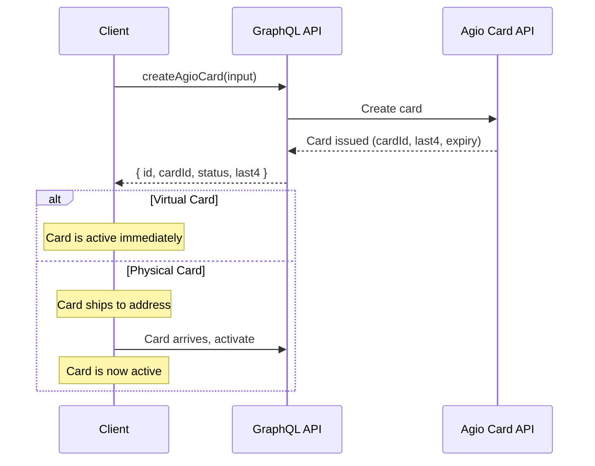
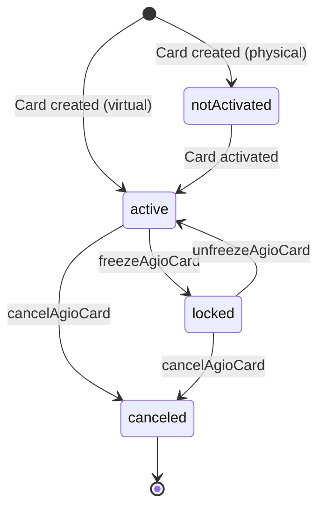

# Creating & Managing Cards

Once a card application is approved, you can create virtual and physical Visa cards using the `createAgioCard` mutation. This guide covers card creation, lifecycle management, and all available card operations.

## Creating Cards

### Creation Flow



### The createAgioCard Mutation

```graphql
mutation CreateAgioCard($input: CreateAgioCardInput!) {
  createAgioCard(input: $input) {
    success
    id
    cardId
    cardType
    status
    last4
    expirationMonth
    expirationYear
    error
  }
}
```

### Creating a Virtual Card

Virtual cards are available immediately after creation.

```graphql
# Variables
{
  "input": {
    "cardApplicationId": 42,
    "cardType": "virtual",
    "limit": {
      "amount": 50000,
      "frequency": "per30DayPeriod"
    },
    "displayName": "JANE SMITH"
  }
}
```

### Creating a Physical Card

Physical cards require a shipping address and phone number. The card ships to the provided address and must be activated upon receipt.

```graphql
# Variables
{
  "input": {
    "cardApplicationId": 42,
    "cardType": "physical",
    "limit": {
      "amount": 100000,
      "frequency": "per30DayPeriod"
    },
    "displayName": "JANE SMITH",
    "shipping": {
      "firstName": "Jane",
      "lastName": "Smith",
      "phoneNumber": "+15555551234",
      "line1": "123 Main St",
      "city": "Miami",
      "region": "FL",
      "postalCode": "33101",
      "countryCode": "US",
      "method": "standard"
    }
  }
}
```

### Input Fields

| Field               | Type                  | Description                                                                                               |
| ------------------- | --------------------- | --------------------------------------------------------------------------------------------------------- |
| `cardApplicationId` | Int!                  | ID of the approved card application                                                                       |
| `cardType`          | AgioCardType!         | `"virtual"` or `"physical"`                                                                               |
| `limit`             | CardLimitInput        | Spending limit: `{ amount, frequency }`                                                                   |
| `displayName`       | String                | Name printed on card (max 26 chars, alphanumeric + spaces + periods + hyphens). Immutable after creation. |
| `shipping`          | AgioCardShippingInput | Required for physical cards. Ignored for virtual.                                                         |
| `billing`           | AgioCardAddressInput  | Billing address. Defaults to shipping address if omitted.                                                 |
| `sessionId`         | String                | From `generateEncryptionKeys` (required if setting PIN)                                                   |
| `encryptedPin`      | String                | Pre-encrypted PIN (4-12 digits)                                                                           |

### Spending Limit Frequencies

| Frequency          | Description            |
| ------------------ | ---------------------- |
| `per24HourPeriod`  | Rolling 24-hour window |
| `per7DayPeriod`    | Rolling 7-day window   |
| `per30DayPeriod`   | Rolling 30-day window  |
| `perYearPeriod`    | Rolling 365-day window |
| `perAuthorization` | Per-transaction cap    |
| `allTime`          | Lifetime total limit   |

:::warning Amounts in Cents
All limit amounts are in cents. `50000` = $500.00, `100000` = $1,000.00.
:::

## Card Status Lifecycle



| Status         | Description                                     | Reversible     |
| -------------- | ----------------------------------------------- | -------------- |
| `notActivated` | Issued but requires activation (physical cards) | Yes            |
| `active`       | Fully functional                                | --             |
| `locked`       | Temporarily frozen                              | Yes (unfreeze) |
| `canceled`     | Permanently disabled                            | No             |

## Card Management

### Freeze a Card

Temporarily disable a card. The card cannot be used for transactions while frozen.

```graphql
mutation FreezeAgioCard($cardId: Int!) {
  freezeAgioCard(cardId: $cardId) {
    success
    id
    cardId
    status
    error
  }
}
```

### Unfreeze a Card

Re-enable a frozen card.

```graphql
mutation UnfreezeAgioCard($cardId: Int!) {
  unfreezeAgioCard(cardId: $cardId) {
    success
    id
    cardId
    status
    error
  }
}
```

### Cancel a Card

Permanently cancel a card. This action is irreversible.

```graphql
mutation CancelAgioCard($input: CancelAgioCardInput!) {
  cancelAgioCard(input: $input) {
    success
    id
    cardId
    status
    error
  }
}
```

```graphql
# Variables
{
  "input": {
    "cardId": 42,
    "reason": "No longer needed"
  }
}
```

### Replace a Virtual Card

Generate a new card number for an existing virtual card. The old card is canceled automatically and the new card inherits spending limits.

```graphql
mutation ReplaceVirtualAgioCard($cardId: Int!) {
  replaceVirtualAgioCard(cardId: $cardId) {
    success
    id
    oldCardId
    newCard {
      id
      type
      status
      last4
      expirationMonth
      expirationYear
    }
    error
  }
}
```

### Replace Any Card (Lost/Stolen/Damaged)

Replace a virtual or physical card with a reason code. Physical card replacements require a shipping address.

```graphql
mutation ReplaceAgioCard($input: ReplaceAgioCardInput!) {
  replaceAgioCard(input: $input) {
    success
    id
    oldCardId
    newCard {
      id
      type
      status
      last4
      expirationMonth
      expirationYear
    }
    error
  }
}
```

```graphql
# Variables (physical card replacement)
{
  "input": {
    "cardId": 42,
    "reason": "lost",
    "shippingAddress": {
      "firstName": "Jane",
      "lastName": "Smith",
      "phoneNumber": "+15555551234",
      "line1": "123 Main St",
      "city": "Miami",
      "region": "FL",
      "postalCode": "33101",
      "countryCode": "US"
    }
  }
}
```

Replacement reasons: `lost`, `stolen`, `damaged`.

### Update Spending Limit

```graphql
mutation UpdateAgioCardLimit($input: UpdateAgioCardLimitInput!) {
  updateAgioCardLimit(input: $input) {
    success
    id
    cardId
    limitAmount
    limitFrequency
    error
  }
}
```

```graphql
# Variables
{
  "input": {
    "cardId": 42,
    "limitAmount": 200000,
    "limitFrequency": "per30DayPeriod"
  }
}
```

### Rename a Card

Update the card's display nickname (max 26 characters).

```graphql
mutation UpdateCardNickname($cardId: Int!, $nickname: String!) {
  updateCardNickname(cardId: $cardId, nickname: $nickname) {
    success
    id
    error
  }
}
```

### Star/Unstar a Card

Mark a card as a favorite.

```graphql
mutation UpdateCardStarred($cardId: Int!, $isStarred: Boolean!) {
  update_AgioCard_card_by_pk(pk_columns: { id: $cardId }, _set: { is_starred: $isStarred }) {
    id
    is_starred
  }
}
```

## PIN Management

PINs are encrypted using RSA + AES-128-GCM. You must first generate an encryption session, then pass the `sessionId` with PIN operations.

### Set or Update PIN

```graphql
mutation SetAgioCardPin($input: SetAgioCardPinInput!) {
  setAgioCardPin(input: $input) {
    success
    id
    error
  }
}
```

```graphql
# Variables
{
  "input": {
    "cardId": 42,
    "sessionId": "session-id-from-generateEncryptionKeys",
    "encryptedPin": "encrypted-pin-value"
  }
}
```

PIN requirements: 4-12 digits, no repeated digits (e.g., `1111`), no sequential patterns (e.g., `1234`, `4321`).

### Reveal PIN

```graphql
mutation GetAgioCardPin($cardId: Int!, $sessionId: String!) {
  getAgioCardPin(cardId: $cardId, sessionId: $sessionId) {
    success
    id
    encryptedPin
    error
  }
}
```

The response `encryptedPin` must be decrypted client-side using the session key.

## Card Secrets

Reveal the full card number (PAN), CVC, and expiry. Secrets are returned encrypted and must be decrypted client-side.

```graphql
mutation RevealAgioCardSecrets($cardId: Int!, $sessionId: String!) {
  revealAgioCardSecrets(cardId: $cardId, sessionId: $sessionId) {
    success
    id
    encryptedSecrets
    error
  }
}
```

The `encryptedSecrets` field contains a JSON string that, when decrypted, yields:

```json
{
  "pan": "4111111111111234",
  "cvc": "123",
  "expiry": { "month": "12", "year": "2028" }
}
```

:::danger Security
Never store decrypted card secrets. Only request them when absolutely necessary for display to the cardholder.
:::

## Listing Cards

Query all cards for the authenticated user:

```graphql
query vwCards($where: AgioCard_vw_card_bool_exp, $limit: Int = 100, $offset: Int, $includeBalance: Boolean! = false) {
  cards: AgioCard_vw_card(where: $where, order_by: [{ last_used_at: desc_nulls_last }, { status: asc }, { created_at: desc }], limit: $limit, offset: $offset) {
    id
    card_type
    status
    last4
    nickname
    is_starred
    created_at
    last_used_at
    balance @include(if: $includeBalance) {
      credit_limit
      spending_power
      pending_charges
      posted_charges
      balance_due
    }
  }
}
```

## Next Steps

- [Funding & Withdrawals](/guides/cards/funding) — Deposit stablecoins and withdraw collateral
- [Transactions & Analytics](/guides/cards/transactions) — Query transactions and monitor spending
