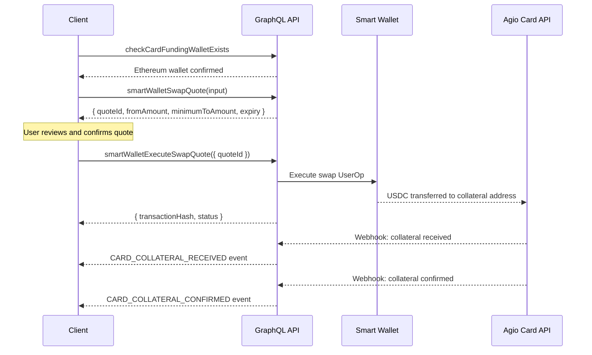
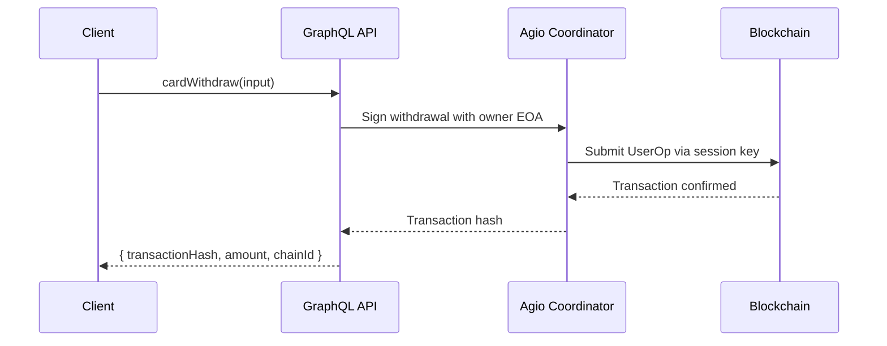

# Funding & Withdrawals

Agio Cards are backed by stablecoin collateral. Depositing tokens into a Agio Card smart wallet establishes a credit limit. Withdrawing moves collateral back to the user's wallet. This guide covers the full deposit and withdrawal flows.

## Deposit Flow (Wallet to Card)

Funding a card is a two-step process: get a swap quote, then execute it. The swap converts tokens from the user's smart wallet into USDC and sends them to the Agio collateral address.

### Deposit Sequence



### Step 1: Verify Funding Wallet

Confirm the user has an Ethereum smart wallet capable of funding cards:

```graphql
query checkCardFundingWalletExists($userId: String, $organizationId: uuid) {
  AgioCrypto_digital_wallet(
    where: {
      network_id: { _eq: 60 }
      wallet_type_id: { _in: [3, 7] }
      deleted: { _eq: false }
      readonly: { _eq: false }
      _or: [{ user_id: { _eq: $userId }, organization_id: { _is_null: true } }, { organization_id: { _eq: $organizationId } }]
    }
    limit: 1
  ) {
    id
    nickname
    wallet_type_id
    network_id
  }
}
```

If no wallet is returned, the user must create an Ethereum smart wallet before funding cards. See [Creating Wallets](/guides/wallets/create).

### Step 2: Get a Swap Quote

Request a quote to convert tokens into USDC for the card collateral:

```graphql
mutation SmartWalletSwapQuote($input: SmartWalletSwapInput!) {
  smartWalletSwapQuote(input: $input) {
    success
    quote {
      quoteId
      fromAmount
      minimumToAmount
      expiry
      priceImpactPct
      amountInUsd
      amountOutUsd
      networkFeeUsd
      estimatedFillSeconds
      route {
        provider
        providersQueried
      }
    }
    error
  }
}
```

```graphql
# Variables
{
  "input": {
    "digitalWalletId": "123",
    "fromToken": "0xA0b86991c6218b36c1d19D4a2e9Eb0cE3606eB48",
    "toToken": "0xA0b86991c6218b36c1d19D4a2e9Eb0cE3606eB48",
    "amount": "100000000",
    "recipient": "0xRainCollateralAddress..."
  }
}
```

| Field             | Description                                                                                                  |
| ----------------- | ------------------------------------------------------------------------------------------------------------ |
| `digitalWalletId` | The user's smart wallet ID                                                                                   |
| `fromToken`       | Token contract address to swap from                                                                          |
| `toToken`         | USDC contract address (destination)                                                                          |
| `amount`          | Amount in wei (smallest unit). For USDC with 6 decimals, `100000000` = 100 USDC.                             |
| `recipient`       | Agio collateral wallet address. When set, swap output goes directly to this address.                         |
| `providers`       | Optional. Array of swap providers to query (e.g., `["RELAY", "ALCHEMY"]`). Defaults to best-route selection. |

### Step 3: Execute the Swap

After the user reviews and confirms the quote, execute it:

```graphql
mutation SmartWalletExecuteSwapQuote($input: SmartWalletExecuteSwapQuoteInput!) {
  smartWalletExecuteSwapQuote(input: $input) {
    success
    transactionHash
    quoteId
    status
    error
  }
}
```

```graphql
# Variables
{
  "input": {
    "quoteId": 456
  }
}
```

The `quoteId` is returned from the swap quote response. Quotes have an expiry — if the quote has expired, request a new one.

### Confirmation Events

After execution, the platform emits events as the collateral is processed:

| Event                       | Description                                         |
| --------------------------- | --------------------------------------------------- |
| `CARD_COLLATERAL_RECEIVED`  | Agio has received the stablecoin deposit            |
| `CARD_COLLATERAL_CONFIRMED` | Collateral is confirmed and credit limit is updated |

Listen for these events via the `CardApplicationUpdates` subscription or the event bus to update the UI.

## Withdrawal Flow (Card to Wallet)

Withdraw collateral from a Agio Card smart wallet back to the user's wallet.

### Withdrawal Sequence



### Execute a Withdrawal

```graphql
mutation CardWithdraw($input: CardWithdrawInput!) {
  cardWithdraw(input: $input) {
    success
    transactionHash
    chainId
    tokenAddress
    amount
    error
    retryAfterSec
  }
}
```

```graphql
# Variables
{
  "input": {
    "tokenAddress": "0xA0b86991c6218b36c1d19D4a2e9Eb0cE3606eB48",
    "amount": "100.5",
    "chainId": 1
  }
}
```

| Field          | Type    | Description                                                                                     |
| -------------- | ------- | ----------------------------------------------------------------------------------------------- |
| `tokenAddress` | String! | ERC-20 token contract address to withdraw                                                       |
| `amount`       | String! | Human-readable amount (e.g., `"100.5"` for 100.5 USDC)                                          |
| `chainId`      | Int     | Chain ID to withdraw from. When omitted, resolved by matching `tokenAddress` across all chains. |

:::warning Signature Conflicts
If the withdrawal fails with a `retryAfterSec` value, it means a Agio signature is currently active (e.g., from a pending deposit). The client should display this to the user and retry after the specified number of seconds.
:::

## Balance Queries

### Single Card Balance

Query the balance for a specific card:

```graphql
query AgioCardBalance($cardId: Int!) {
  rainCardBalance(cardId: $cardId) {
    success
    id
    balance {
      creditLimit
      pendingCharges
      postedCharges
      balanceDue
      spendingPower
    }
    error
  }
}
```

### Balance Fields

| Field            | Type  | Description                                                              |
| ---------------- | ----- | ------------------------------------------------------------------------ |
| `creditLimit`    | Float | Total credit limit based on deposited collateral (USD)                   |
| `pendingCharges` | Float | Authorized but not yet settled transactions (USD)                        |
| `postedCharges`  | Float | Settled transactions (USD)                                               |
| `balanceDue`     | Float | Amount currently owed (USD)                                              |
| `spendingPower`  | Float | Available to spend: `creditLimit - pendingCharges - postedCharges` (USD) |

### Example Balance

For a card with $1,000 in collateral and $150 in pending purchases:

```json
{
  "creditLimit": 1000.0,
  "pendingCharges": 150.0,
  "postedCharges": 0.0,
  "balanceDue": 0.0,
  "spendingPower": 850.0
}
```

### Bulk Balance via vwCards

To fetch balances alongside card listings, use the `includeBalance` flag on the `vwCards` query:

```graphql
query vwCards($includeBalance: Boolean! = true) {
  cards: AgioCard_vw_card(limit: 100) {
    id
    card_type
    status
    last4
    balance @include(if: $includeBalance) {
      credit_limit
      spending_power
      pending_charges
      posted_charges
      balance_due
    }
  }
}
```

## Next Steps

- [Transactions & Analytics](/guides/cards/transactions) — Query transactions and monitor spending
- [Creating & Managing Cards](/guides/cards/create) — Card lifecycle and management operations
