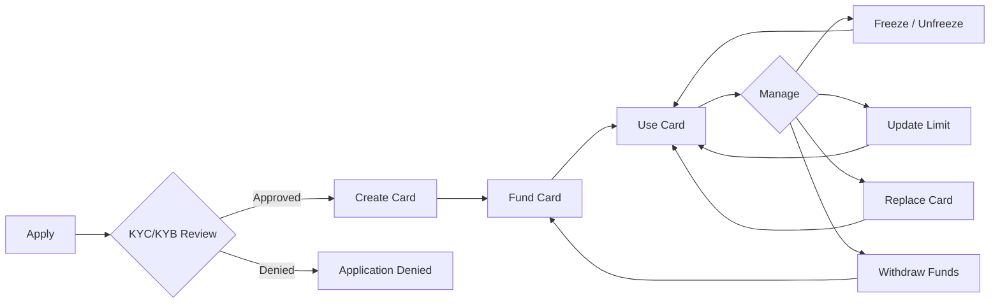

# Cards Overview

Agio Cards are crypto-collateralized Visa credit cards backed by stablecoin deposits (USDC or PYUSD). Depositing stablecoins into a Agio Card smart wallet establishes a credit limit, and cardholders can spend up to that limit using virtual or physical Visa cards anywhere Visa is accepted.

All card operations are performed via GraphQL through the Agio Platform API.

## Card Lifecycle

## Virtual vs Physical Cards

| Feature             | Virtual                                              | Physical                                 |
| ------------------- | ---------------------------------------------------- | ---------------------------------------- |
| **Availability**    | Instant — ready to use immediately                   | Ships globally (free standard shipping)  |
| **Use cases**       | Online purchases, subscriptions                      | In-person, ATM, tap-to-pay               |
| **Shipping**        | Not required                                         | Required (address + phone number)        |
| **PIN**             | Set at creation                                      | Staged at creation, activated on receipt |
| **Replacement**     | `replaceVirtualAgioCard` — new card number instantly | `replaceAgioCard` with shipping address  |
| **Spending limits** | Configurable (rolling period)                        | Configurable (rolling period)            |
| **Cancellation**    | Permanent, irreversible                              | Permanent, irreversible                  |

## Quick Reference

| Action                 | GraphQL Operation                                      | Type         |
| ---------------------- | ------------------------------------------------------ | ------------ |
| List cards             | `vwCards`                                              | Query        |
| Apply (individual)     | `createAgioCardApplication`                            | Mutation     |
| Apply (corporate)      | `createRainCorporateApplication`                       | Mutation     |
| Create card            | `createAgioCard`                                       | Mutation     |
| Freeze card            | `freezeAgioCard`                                       | Mutation     |
| Unfreeze card          | `unfreezeAgioCard`                                     | Mutation     |
| Cancel card            | `cancelAgioCard`                                       | Mutation     |
| Replace virtual card   | `replaceVirtualAgioCard`                               | Mutation     |
| Replace any card       | `replaceAgioCard`                                      | Mutation     |
| Update spending limit  | `updateAgioCardLimit`                                  | Mutation     |
| Set PIN                | `setAgioCardPin`                                       | Mutation     |
| Reveal PIN             | `getAgioCardPin`                                       | Mutation     |
| Reveal card secrets    | `revealAgioCardSecrets`                                | Mutation     |
| Rename card            | `updateCardNickname`                                   | Mutation     |
| Star/unstar card       | `updateCardStarred`                                    | Mutation     |
| Fund card              | `smartWalletSwapQuote` → `smartWalletExecuteSwapQuote` | Mutation     |
| Withdraw collateral    | `cardWithdraw`                                         | Mutation     |
| Card balance           | `rainCardBalance`                                      | Query        |
| View transactions      | `UserCardTransactions`                                 | Query        |
| Real-time transactions | `CardTransactionUpdates`                               | Subscription |
| Application updates    | `CardApplicationUpdates`                               | Subscription |

:::warning Amounts in Cents
All monetary amounts in the Agio Card API are in **cents** (smallest currency unit). `50000` = $500.00. The only exception is `cardWithdraw`, which accepts human-readable token amounts (e.g., `"100.5"`).
:::

## Guides

  <a class="vt-box" href="/guides/cards/apply">
    
Applying for Cards

    
KYC and KYB application flows for individuals and companies.

  </a>
  <a class="vt-box" href="/guides/cards/create">
    
Creating & Managing Cards

    
Create virtual and physical cards, freeze, replace, and update limits.

  </a>
  <a class="vt-box" href="/guides/cards/funding">
    
Funding & Withdrawals

    
Deposit stablecoins to fund cards and withdraw collateral.

  </a>
  <a class="vt-box" href="/guides/cards/transactions">
    
Transactions & Analytics

    
Query card transactions and monitor spending in real time.

  </a>
  <a class="vt-box" href="/guides/cards/partner-api">
    
Partner Card API

    
HMAC-authenticated GraphQL endpoint for external card-issuing partners.

  </a>

