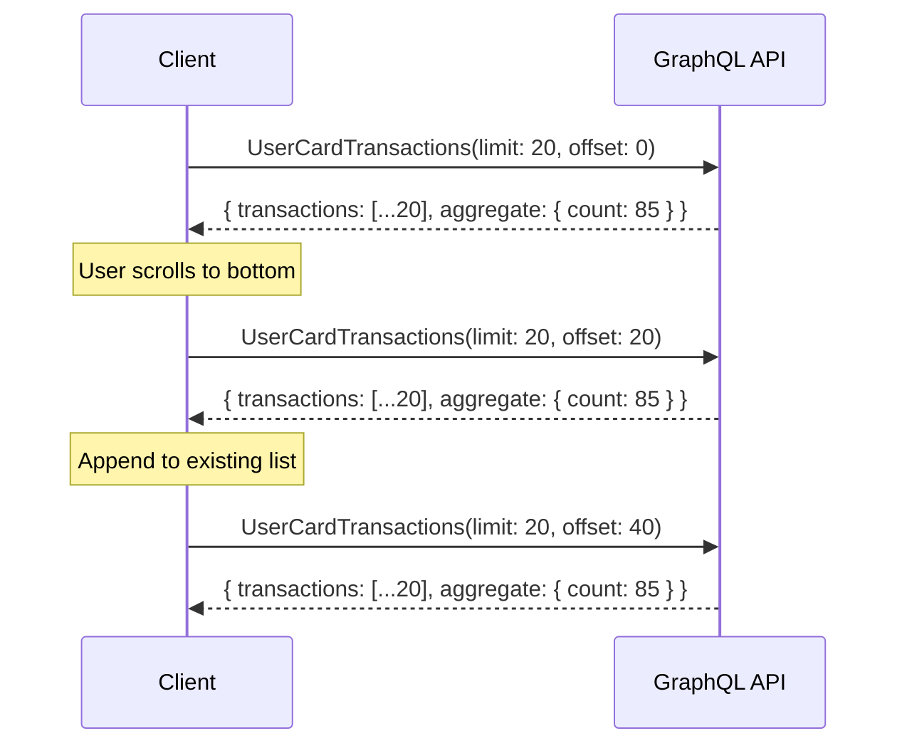

# Transactions & Analytics

This guide covers querying card transactions, paginating results, and monitoring spending activity in real time.

## Querying Transactions

### Transaction Query

Fetch transactions for a specific card application with filtering and pagination:

```graphql
query UserCardTransactions($where: AgioCard_card_transaction_bool_exp, $order_by: [AgioCard_card_transaction_order_by!], $limit: Int, $offset: Int) {
  transactions: AgioCard_card_transaction(where: $where, order_by: $order_by, limit: $limit, offset: $offset) {
    id
    card_application_id
    rain_transaction_id
    event_type
    transaction_type
    status
    amount
    currency
    merchant_name
    merchant_category
    merchant_category_code
    merchant_city
    merchant_country
    local_amount
    local_currency
    authorized_amount
    authorization_method
    card_type
    enriched_merchant_icon
    enriched_merchant_name
    enriched_merchant_category
    declined_reason
    authorized_at
    posted_at
    created_at
  }
  transactions_aggregate: AgioCard_card_transaction_aggregate(where: $where) {
    aggregate {
      count
    }
  }
}
```

### Fetch Recent Transactions for a Card

```graphql
# Variables
{
  "where": {
    "card_application_id": { "_eq": 42 }
  },
  "order_by": [{ "created_at": "desc" }],
  "limit": 20,
  "offset": 0
}
```

### Filter by Transaction Status

```graphql
# Variables — settled transactions only
{
  "where": {
    "card_application_id": { "_eq": 42 },
    "status": { "_eq": "posted" }
  },
  "order_by": [{ "posted_at": "desc" }],
  "limit": 50
}
```

### Filter by Date Range

```graphql
# Variables — transactions from the last 30 days
{
  "where": {
    "card_application_id": { "_eq": 42 },
    "created_at": { "_gte": "2026-02-21T00:00:00Z" }
  },
  "order_by": [{ "created_at": "desc" }],
  "limit": 100
}
```

## Transaction Fields

| Field                        | Description                                                               |
| ---------------------------- | ------------------------------------------------------------------------- |
| `event_type`                 | Event category (e.g., `authorization`, `clearing`, `refund`)              |
| `transaction_type`           | Transaction type (e.g., `purchase`, `atm_withdrawal`, `fee`)              |
| `status`                     | Transaction status (e.g., `authorized`, `posted`, `declined`, `reversed`) |
| `amount`                     | Transaction amount in the card's currency                                 |
| `currency`                   | Transaction currency code (e.g., `USD`)                                   |
| `local_amount`               | Amount in the merchant's local currency (for international transactions)  |
| `local_currency`             | Merchant's local currency code                                            |
| `authorized_amount`          | Original authorized amount (may differ from final posted amount)          |
| `merchant_name`              | Raw merchant name from the card network                                   |
| `enriched_merchant_name`     | Cleaned and enriched merchant name                                        |
| `enriched_merchant_icon`     | URL to merchant logo/icon                                                 |
| `enriched_merchant_category` | Enriched merchant category                                                |
| `merchant_category_code`     | MCC code (ISO 18245)                                                      |
| `merchant_city`              | Merchant city                                                             |
| `merchant_country`           | Merchant country code                                                     |
| `declined_reason`            | Reason for decline (if `status` is `declined`)                            |
| `authorized_at`              | Timestamp of authorization                                                |
| `posted_at`                  | Timestamp of settlement                                                   |

## Pagination

### Initial Load

Fetch the first page of transactions:

```graphql
# Variables
{
  "where": { "card_application_id": { "_eq": 42 } },
  "order_by": [{ "created_at": "desc" }],
  "limit": 20,
  "offset": 0
}
```

### Load More

Use the `offset` to paginate through results. The `transactions_aggregate.aggregate.count` field tells you the total number of matching transactions.

```graphql
# Variables — page 2
{
  "where": { "card_application_id": { "_eq": 42 } },
  "order_by": [{ "created_at": "desc" }],
  "limit": 20,
  "offset": 20
}
```

### Pagination Pattern



Continue incrementing `offset` by `limit` until `offset >= aggregate.count`.

## All Transactions (Cross-Card)

Fetch transactions across all of the user's cards:

```graphql
query AllUserCardTransactions($limit: Int = 100, $offset: Int = 0) {
  AgioCard_card_transaction(order_by: { created_at: desc }, limit: $limit, offset: $offset) {
    id
    event_type
    transaction_type
    status
    amount
    currency
    merchant_name
    enriched_merchant_name
    enriched_merchant_icon
    enriched_merchant_category
    card_type
    created_at
    card_application {
      id
      wallet_address
    }
  }
}
```

## Real-Time Updates

### Transaction Subscription

Subscribe to live transaction updates for a specific card application:

```graphql
subscription CardTransactionUpdates($card_application_id: Int) {
  AgioCard_card_transaction(where: { card_application_id: { _eq: $card_application_id } }, order_by: { created_at: desc }, limit: 50) {
    id
    event_type
    transaction_type
    status
    amount
    currency
    merchant_name
    enriched_merchant_name
    enriched_merchant_icon
    created_at
  }
}
```

```graphql
# Variables
{
  "card_application_id": 42
}
```

This subscription emits whenever a new transaction is created or an existing transaction's status changes (e.g., from `authorized` to `posted`).

### Event Bus

The platform also emits a `CARD_SPEND_COMPLETED` event when a transaction is finalized, which can be used for notifications or analytics triggers.

| Event                       | Description                                          |
| --------------------------- | ---------------------------------------------------- |
| `CARD_SPEND_COMPLETED`      | A card transaction has been settled/completed        |
| `CARD_COLLATERAL_RECEIVED`  | A collateral deposit has been received               |
| `CARD_COLLATERAL_CONFIRMED` | A collateral deposit has been confirmed on-chain     |
| `CARD_STATUS_CHANGED`       | A card's status has changed (frozen, canceled, etc.) |

## Analytics

### Spending by Merchant Category

Use the `enriched_merchant_category` and `merchant_category_code` fields to group transactions by spending category. Query all posted transactions and aggregate client-side:

```graphql
# Variables — all posted transactions for the current month
{
  "where": {
    "card_application_id": { "_eq": 42 },
    "status": { "_eq": "posted" },
    "posted_at": { "_gte": "2026-03-01T00:00:00Z" }
  },
  "order_by": [{ "posted_at": "desc" }],
  "limit": 500
}
```

Group the results by `enriched_merchant_category` to build category breakdowns (e.g., dining, travel, software subscriptions).

### Transaction Aggregates

Use the `transactions_aggregate` field to get counts and totals without fetching full transaction records:

```graphql
query CardTransactionCount($where: AgioCard_card_transaction_bool_exp) {
  AgioCard_card_transaction_aggregate(where: $where) {
    aggregate {
      count
    }
  }
}
```

```graphql
# Variables — count declined transactions
{
  "where": {
    "card_application_id": { "_eq": 42 },
    "status": { "_eq": "declined" }
  }
}
```

## Next Steps

- [Cards Overview](/guides/cards/) — Quick reference for all card operations
- [Funding & Withdrawals](/guides/cards/funding) — Deposit and withdraw collateral
- [Creating & Managing Cards](/guides/cards/create) — Card lifecycle and management
