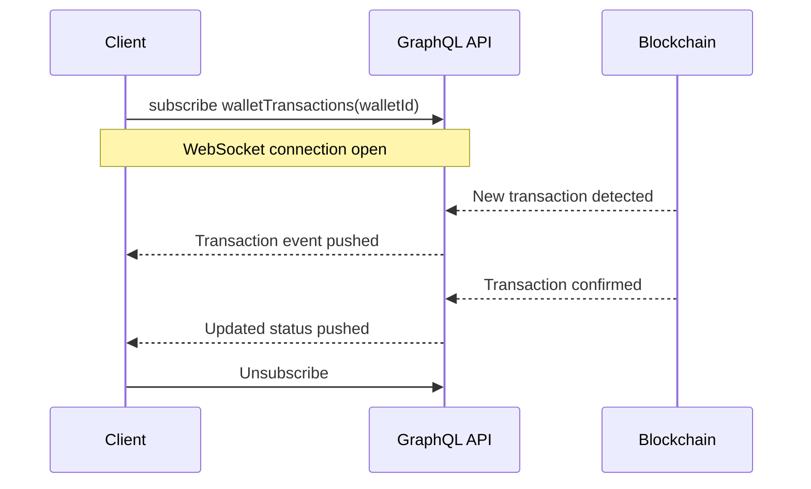

# Viewing Balances & Assets

This guide covers how to query wallet data, including listing wallets, viewing individual wallet details, and tracking balances in real time.

## List All Wallets with Balances

The `walletsWithBalanceUnified` query returns all wallets for the authenticated user with their current balances and token holdings.

```graphql
query walletsWithBalanceUnified {
  walletsWithBalanceUnified {
    id
    label
    wallet_type_id
    usdValue
    assets {
      symbol
      name
      balance
      usdValue
      tokenAddress
      chainId
    }
  }
}
```

### Response Shape

```json
{
  "data": {
    "walletsWithBalanceUnified": [
      {
        "id": 42,
        "label": "My Smart Wallet",
        "wallet_type_id": 2,
        "usdValue": 12450.75,
        "assets": [
          {
            "symbol": "ETH",
            "name": "Ethereum",
            "balance": "3.5",
            "usdValue": 11200.5,
            "tokenAddress": null,
            "chainId": 1
          },
          {
            "symbol": "USDC",
            "name": "USD Coin",
            "balance": "1250.25",
            "usdValue": 1250.25,
            "tokenAddress": "0xA0b86991c6218b36c1d19D4a2e9Eb0cE3606eB48",
            "chainId": 1
          }
        ]
      }
    ]
  }
}
```

The top-level `usdValue` on each wallet is the sum of all asset USD values within that wallet.

## Single Wallet Detail

Use `WalletUnifiedData` to retrieve a single wallet with its full details, including transactions and approval statuses.

```graphql
query WalletUnifiedData($walletId: Int!) {
  WalletUnifiedData(walletId: $walletId) {
    id
    label
    wallet_type_id
    usdValue
    address
    assets {
      symbol
      name
      balance
      usdValue
      tokenAddress
      chainId
    }
    transactions {
      id
      type
      amount
      symbol
      status
      txHash
      createdAt
    }
    approvals {
      id
      status
      requiredApprovals
      currentApprovals
    }
  }
}
```

Variables:

```json
{
  "walletId": 42
}
```

This query is useful for building wallet detail pages where you need balances, recent transactions, and any pending approvals in a single request.

## Smart Wallet Status

For smart wallets (type `2`), use `GetMySmartWalletStatus` to retrieve account-abstraction-specific information such as session keys, deployment status, and gas sponsorship.

```graphql
query GetMySmartWalletStatus($walletId: Int!) {
  GetMySmartWalletStatus(walletId: $walletId) {
    walletId
    address
    isDeployed
    chainId
    sessionKeys {
      address
      expiresAt
      permissions
    }
    gasSponsorshipActive
  }
}
```

Variables:

```json
{
  "walletId": 42
}
```

### Response Shape

```json
{
  "data": {
    "GetMySmartWalletStatus": {
      "walletId": 42,
      "address": "0x1234...abcd",
      "isDeployed": true,
      "chainId": 1,
      "sessionKeys": [
        {
          "address": "0xaaaa...bbbb",
          "expiresAt": "2026-06-01T00:00:00Z",
          "permissions": ["TRANSFER", "SWAP"]
        }
      ],
      "gasSponsorshipActive": true
    }
  }
}
```

## How Token Balances Map to USD

Each asset in a wallet response includes both a raw `balance` (the on-chain token amount) and a `usdValue` (the balance multiplied by the current market price).

```
usdValue = balance * currentPrice
```

The platform calculates USD values server-side using live price feeds. The wallet-level `usdValue` is the aggregate of all its asset USD values.

For scenarios where you need the current price independently:

```graphql
query coinPrice($symbol: String!) {
  coinPrice(symbol: $symbol) {
    symbol
    priceUsd
    change24h
  }
}
```

## Real-Time Updates

### Polling with Query Refetch

For simple implementations, refetch `walletsWithBalanceUnified` or `WalletUnifiedData` on a timed interval. A 30-second interval balances freshness with API usage:

```typescript
const { result, refetch } = useQuery(WalletsWithBalanceUnifiedDocument);

const pollInterval = setInterval(() => {
  refetch();
}, 30_000);
```

### Subscription for Real-Time Transactions

For immediate updates when transactions land, use the `walletTransactions` subscription:

```graphql
subscription walletTransactions($walletId: Int!) {
  walletTransactions(walletId: $walletId) {
    id
    type
    amount
    symbol
    status
    txHash
    createdAt
  }
}
```

Variables:

```json
{
  "walletId": 42
}
```

The subscription emits events as transactions are detected on-chain. Use this to update the UI without polling:



Subscriptions are delivered over WebSocket. Ensure your Apollo Client is configured with a WebSocket link for subscription support.

## Next Steps

- [Creating Wallets](/guides/wallets/create) — Set up new wallets of any type
- [Transfers & Swaps](/guides/wallets/transfers) — Send crypto and swap tokens
