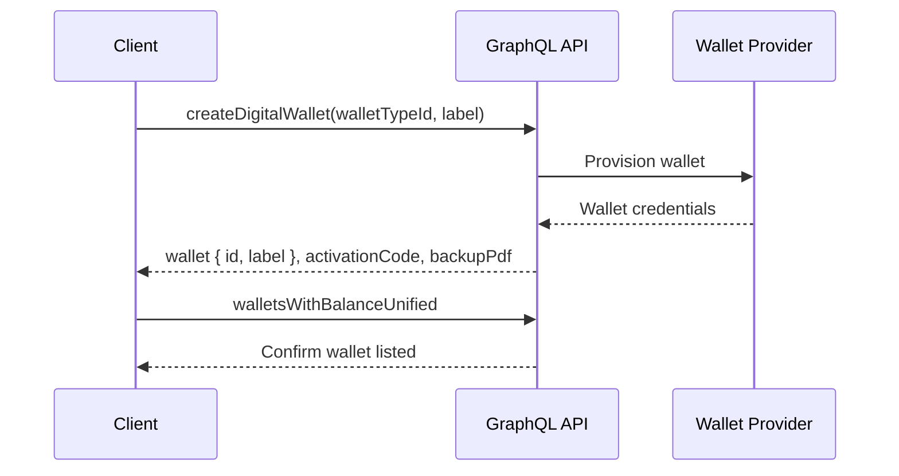
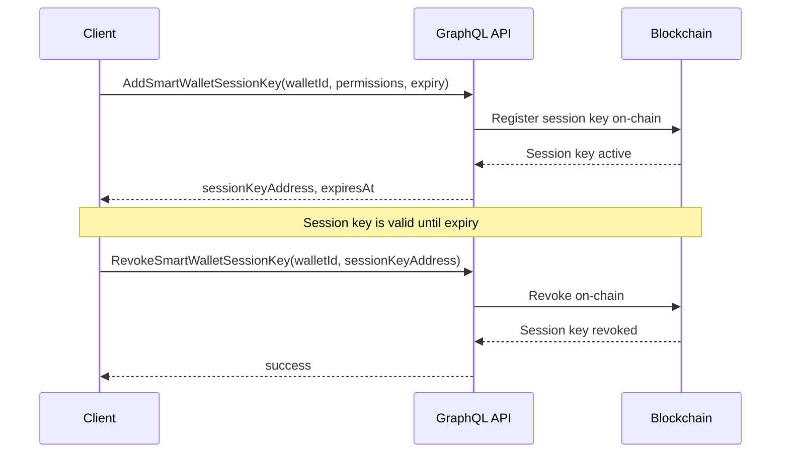

# Creating Wallets

This guide walks through creating each wallet type using the `createDigitalWallet` mutation.

## Overview



All wallet types use the same mutation. The `walletTypeId` parameter determines which provider and configuration is used.

## The createDigitalWallet Mutation

```graphql
mutation createDigitalWallet($walletTypeId: Int!, $label: String!, $options: jsonb) {
  createDigitalWallet(walletTypeId: $walletTypeId, label: $label, options: $options) {
    wallet {
      id
      label
      wallet_type_id
    }
    activationCode
    backupPdf
    errors
    warnings
  }
}
```

### Response Fields

| Field            | Type     | Description                                                 |
| ---------------- | -------- | ----------------------------------------------------------- |
| `wallet`         | Object   | The created wallet with `id`, `label`, and `wallet_type_id` |
| `activationCode` | String   | Activation code for BitGo wallets (custodial and hot)       |
| `backupPdf`      | String   | Base64-encoded backup PDF with recovery information         |
| `errors`         | [String] | Any errors that occurred during creation                    |
| `warnings`       | [String] | Non-fatal warnings about the created wallet                 |

## Creating a Custodial Wallet

Custodial wallets (type `0`) are managed by BitGo with multi-signature approval policies.

```graphql
# Variables
{
  "walletTypeId": 0,
  "label": "My Custodial Wallet"
}
```

The response includes an `activationCode` and `backupPdf`. Store the backup PDF securely — it contains key recovery information.

## Creating a Hot Wallet

Hot wallets (type `1`) require a follow-up step to generate encryption keys that the client retains.

**Step 1: Create the wallet**

```graphql
# Variables
{
  "walletTypeId": 1,
  "label": "My Hot Wallet"
}
```

**Step 2: Generate encryption keys**

After the wallet is created, call `generateEncryptionKeys` to produce the client-side encryption key pair. This key is required for signing transactions.

```graphql
mutation generateEncryptionKeys($walletId: Int!) {
  generateEncryptionKeys(walletId: $walletId) {
    encryptedPrv
    pub
    errors
  }
}
```

Store the `encryptedPrv` value securely on the client side. It cannot be recovered from the server.

## Creating a Smart Wallet

Smart wallets (type `2`) are ERC-4337 account-abstraction wallets with gasless transaction support.

**Step 1: Create the wallet**

```graphql
# Variables
{
  "walletTypeId": 2,
  "label": "My Smart Wallet"
}
```

Smart wallets do not return an `activationCode` or `backupPdf`. The wallet is ready to use immediately.

**Step 2: Provision a session key**

Session keys allow delegated transaction signing without requiring the owner's signature for every operation.

```graphql
mutation AddSmartWalletSessionKey($walletId: Int!, $permissions: [SmartWalletPermission!]!, $expiry: timestamptz) {
  AddSmartWalletSessionKey(walletId: $walletId, permissions: $permissions, expiry: $expiry) {
    sessionKeyAddress
    expiresAt
    success
    error
  }
}
```

Session keys have a configurable expiry. When a session key is no longer needed, revoke it:

```graphql
mutation RevokeSmartWalletSessionKey($walletId: Int!, $sessionKeyAddress: String!) {
  RevokeSmartWalletSessionKey(walletId: $walletId, sessionKeyAddress: $sessionKeyAddress) {
    success
    error
  }
}
```

### Session Key Lifecycle



## Error Handling

The `errors` array in the response contains actionable error messages. Common scenarios:

| Error                 | Cause                                           | Resolution                               |
| --------------------- | ----------------------------------------------- | ---------------------------------------- |
| `DUPLICATE_LABEL`     | A wallet with this label already exists         | Use a unique label                       |
| `INVALID_WALLET_TYPE` | The `walletTypeId` is not 0, 1, or 2            | Use a valid wallet type ID               |
| `PROVISIONING_FAILED` | The wallet provider could not create the wallet | Retry the request; check provider status |
| `SESSION_KEY_LIMIT`   | Too many active session keys on this wallet     | Revoke unused session keys first         |

Always check both `errors` and `warnings` in the response before proceeding.

## Verify Creation

After creating a wallet, confirm it appears in your wallet list:

```graphql
query walletsWithBalanceUnified {
  walletsWithBalanceUnified {
    id
    label
    wallet_type_id
    usdValue
    assets {
      symbol
      balance
      usdValue
    }
  }
}
```

The new wallet will appear with a zero balance, ready to receive funds.

## Next Steps

- [Balances & Assets](/guides/wallets/balances) — Query wallet balances and token holdings
- [Transfers & Swaps](/guides/wallets/transfers) — Send crypto and swap tokens
