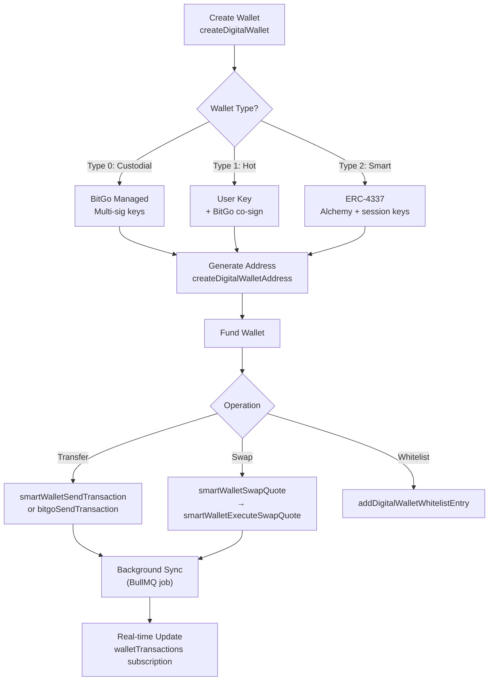

# Wallets Overview

The Agio wallet system provides three distinct wallet types, each designed for different use cases. All wallet operations are performed via GraphQL through the Agio Platform API.

## Wallet Types

### Custodial Wallet (Type ID: 0)

BitGo-managed wallets with institutional-grade security. Transactions require multi-signature approvals and support address whitelisting for controlled fund transfers.

- Multi-sig approval policies
- Address whitelist enforcement
- BitGo-managed key custody
- Best for: organizations requiring compliance controls

### Hot Wallet (Type ID: 1)

User-managed wallets where the client holds an encryption key. These wallets still leverage BitGo infrastructure for transaction signing and security features.

- User-managed encryption keys
- BitGo co-signing
- Whitelist and approval support
- Best for: users who want key ownership with BitGo security

### Smart Wallet (Type ID: 2)

ERC-4337 account-abstraction wallets powered by Alchemy. These wallets support gasless transactions and session keys for delegated signing, with no whitelist or approval overhead.

- Gasless transactions (sponsored gas)
- Session key delegation
- No whitelist or multi-sig requirements
- Best for: end users who want a seamless, gas-free experience

## Wallet Lifecycle

## Quick Reference

| Action             | GraphQL Operation             | Type         |
| ------------------ | ----------------------------- | ------------ |
| List wallets       | `walletsWithBalanceUnified`   | Query        |
| Wallet detail      | `WalletUnifiedData`           | Query        |
| Create wallet      | `createDigitalWallet`         | Mutation     |
| Star/unstar wallet | `updateDigitalWalletStarred`  | Mutation     |
| Send transaction   | `smartWalletSendTransaction`  | Mutation     |
| Get swap quote     | `smartWalletSwapQuote`        | Mutation     |
| Execute swap       | `smartWalletExecuteSwapQuote` | Mutation     |
| Real-time updates  | `walletTransactions`          | Subscription |

## Guides

  <a class="vt-box" href="/guides/wallets/create">
    
Creating Wallets

    
Step-by-step wallet creation for each wallet type.

  </a>
  <a class="vt-box" href="/guides/wallets/balances">
    
Balances & Assets

    
Query wallet balances, token holdings, and portfolio data.

  </a>
  <a class="vt-box" href="/guides/wallets/transfers">
    
Transfers & Swaps

    
Send crypto and swap tokens across chains.

  </a>

