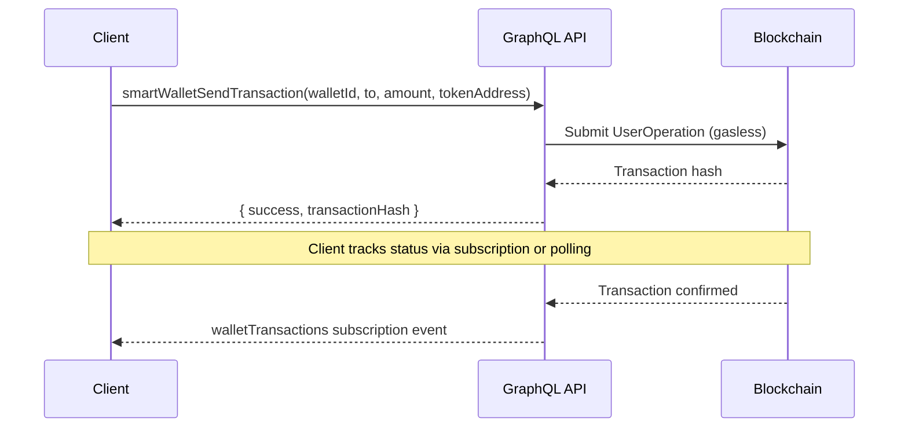
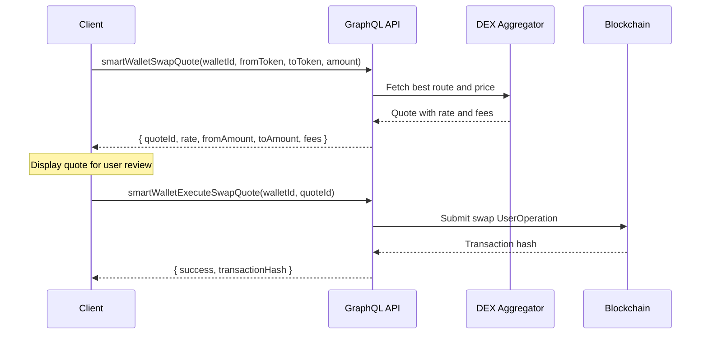

# Transfers & Swaps

This guide covers sending crypto from smart wallets, swapping tokens, and an overview of BitGo wallet transfer mechanisms.

## Smart Wallet Send

Smart wallets (type `2`) use the `smartWalletSendTransaction` mutation for all outbound transfers, including native token and ERC-20 sends. The server handles token encoding, gas sponsorship, and transaction submission.

### Flow



### Mutation

```graphql
mutation smartWalletSendTransaction($walletId: Int!, $to: String!, $amount: String!, $tokenAddress: String) {
  smartWalletSendTransaction(walletId: $walletId, to: $to, amount: $amount, tokenAddress: $tokenAddress) {
    success
    transactionHash
    error
    structuredError {
      code
      message
      details
    }
  }
}
```

### Variables

**Native token transfer (ETH):**

```json
{
  "walletId": 42,
  "to": "0xRecipientAddress...",
  "amount": "0.5",
  "tokenAddress": null
}
```

**ERC-20 token transfer (USDC):**

```json
{
  "walletId": 42,
  "to": "0xRecipientAddress...",
  "amount": "1000",
  "tokenAddress": "0xA0b86991c6218b36c1d19D4a2e9Eb0cE3606eB48"
}
```

When `tokenAddress` is provided, the server encodes the ERC-20 `transfer` call data automatically. The `amount` should be in human-readable units (not wei).

### Response

```json
{
  "data": {
    "smartWalletSendTransaction": {
      "success": true,
      "transactionHash": "0xabc123...",
      "error": null,
      "structuredError": null
    }
  }
}
```

If the transaction fails, `success` will be `false` and either `error` (string) or `structuredError` (object with `code`, `message`, `details`) will be populated.

### Tracking Pending Operations

After submitting a transaction, track its status by subscribing to `walletTransactions` (see [Balances & Assets](/guides/wallets/balances#subscription-for-real-time-transactions)) or by polling `WalletUnifiedData` and checking the `transactions` array for the matching `txHash`.

## Token Swap

Smart wallets support on-chain token swaps through a two-step quote-then-execute flow.

### Flow



### Step 1: Get a Quote

```graphql
mutation smartWalletSwapQuote($walletId: Int!, $fromToken: String!, $toToken: String!, $amount: String!, $chainId: Int) {
  smartWalletSwapQuote(walletId: $walletId, fromToken: $fromToken, toToken: $toToken, amount: $amount, chainId: $chainId) {
    quoteId
    fromToken
    toToken
    fromAmount
    toAmount
    rate
    fees
    expiresAt
    error
  }
}
```

Variables:

```json
{
  "walletId": 42,
  "fromToken": "0xA0b86991c6218b36c1d19D4a2e9Eb0cE3606eB48",
  "toToken": "0xC02aaA39b223FE8D0A0e5C4F27eAD9083C756Cc2",
  "amount": "1000",
  "chainId": 1
}
```

The `amount` is denominated in the `fromToken` in human-readable units. The response includes the expected `toAmount`, the `rate`, and any `fees`.

::: warning Quote Expiry
Quotes have a limited validity window indicated by `expiresAt`. Execute the swap before the quote expires, or request a new quote.
:::

### Step 2: Review the Quote

Before executing, present the quote details to the user:

| Field        | Description                                        |
| ------------ | -------------------------------------------------- |
| `fromAmount` | Amount of the source token being swapped           |
| `toAmount`   | Expected amount of the destination token           |
| `rate`       | Exchange rate (toAmount / fromAmount)              |
| `fees`       | Platform and DEX fees applied to the swap          |
| `expiresAt`  | Timestamp after which the quote is no longer valid |

### Step 3: Execute the Swap

```graphql
mutation smartWalletExecuteSwapQuote($walletId: Int!, $quoteId: String!) {
  smartWalletExecuteSwapQuote(walletId: $walletId, quoteId: $quoteId) {
    success
    transactionHash
    error
    structuredError {
      code
      message
      details
    }
  }
}
```

Variables:

```json
{
  "walletId": 42,
  "quoteId": "quote_abc123"
}
```

### Available Swap Tokens

Query the tokens available for swapping on a given chain:

```graphql
query GetSmartWalletSwapTokensByEvmChainId($chainId: Int!) {
  GetSmartWalletSwapTokensByEvmChainId(chainId: $chainId) {
    address
    symbol
    name
    decimals
    logoUri
  }
}
```

Variables:

```json
{
  "chainId": 1
}
```

Use this to populate token selection dropdowns in your swap UI.

## BitGo Wallet Transfers

Custodial (type `0`) and hot (type `1`) wallets use BitGo infrastructure for transfers. These wallets operate differently from smart wallets:

- **Multi-sig approvals** — Transfers may require one or more approvals before execution, depending on the wallet's policy configuration
- **Whitelist enforcement** — Destination addresses may need to be whitelisted before a transfer is allowed
- **BitGo transaction signing** — The server coordinates with BitGo for co-signing; hot wallets additionally require the client's encryption key

For BitGo wallet operations, the relevant mutations are:

| Operation                           | Description                              |
| ----------------------------------- | ---------------------------------------- |
| `bitgoSendTransaction`              | Initiate a transfer from a BitGo wallet  |
| `bitgoResolveApproval`              | Approve or reject a pending transfer     |
| `addDigitalWalletWhitelistEntry`    | Add an address to the wallet's whitelist |
| `removeDigitalWalletWhitelistEntry` | Remove an address from the whitelist     |

Refer to the [GraphQL API Overview](/api/graphql-overview) for the full schema details on these operations.

## Next Steps

- [Wallets Overview](/guides/wallets/) — Wallet types and quick reference
- [Creating Wallets](/guides/wallets/create) — Set up new wallets
- [Balances & Assets](/guides/wallets/balances) — Query balances and track transactions in real time
